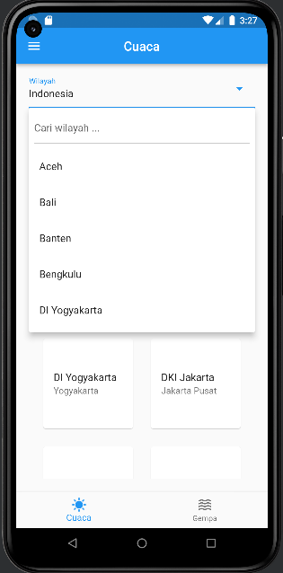
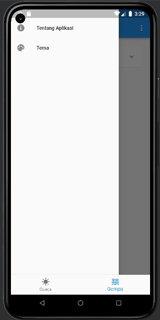

# Info BMKG

Aplikasi untuk menampilkan informasi mengenai cuaca dan gempa yang berasal dari website [Data Terbuka BMKG](https://data.bmkg.go.id/). 

## Aplikasi ini dibuat dengan menggunakan Flutter.

## Fitur Menampilkan informasi cuaca dan gempa suatu provinsi atau kota di Indonesia.

